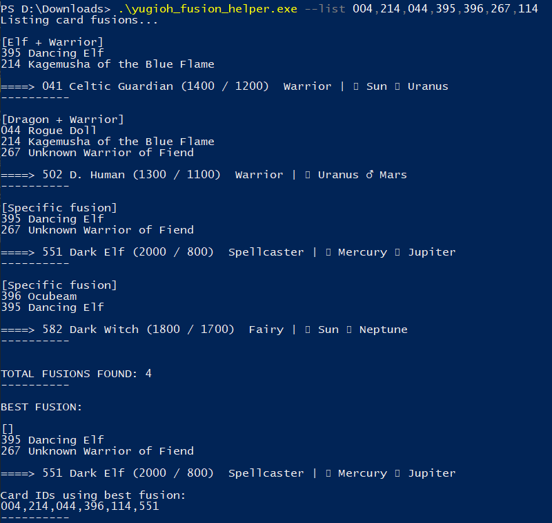

# yugioh-fusion-helper
Web scraper that gets every fusion of the game "Yu-Gi-Oh! Forbidden Memories" (PlayStation 1), given a set of card 
identifications. It was made quicky to win some duels in the game. If you have time, you can improve so much thing 
on this very raw script, like put all in csv files or make a nice GUI. Have fun with retro games! :)



## Usage (Windows)
```powershell
> .\dist\yugioh_fusion_helper.exe --list LIST_OF_CARD_IDS_SEPARATED_BY_COMMA
```

Example:
```powershell
> .\dist\yugioh_fusion_helper.exe --list 004,214,044,395,396
```

Or executing it with python 3
```python
>python -m pip install -r requirements.txt
>python ./yugioh_fusion_helper.py --list LIST_OF_CARD_IDS_SEPARATED_BY_COMMA
```

## Windows users
It is posible that the exe file will be recognize as malware by Windows Defender. It need this to be ignore in order
to execute the program. The only thing that is doing is connecting to the site "https://yugipedia.com" to get the cards
data. If you don't want to ignore the antivirus's warning you can execute the script .py with python (this requires 
python 3 installed).

The exe file in the "/dist" folder was compile using PyInstaller (https://www.pyinstaller.org/) with the following 
command:
```python
> pyinstaller --clean --onefile -c .\yugioh_fusion_helper.py
```
You can compile it by yourself if you want to be sure.
